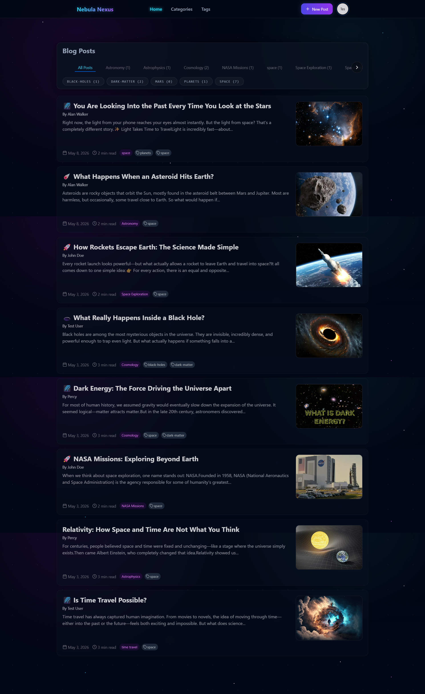
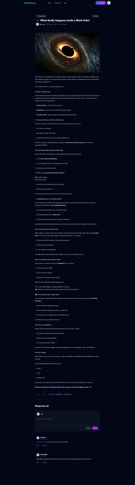
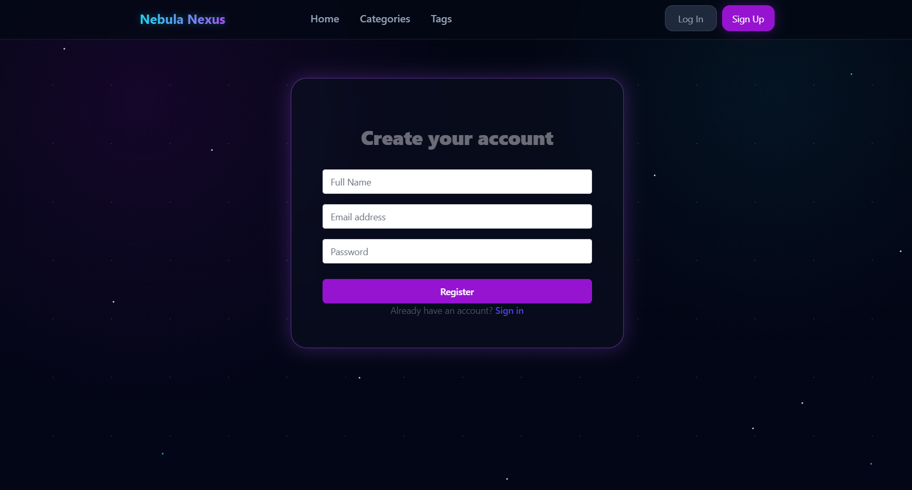
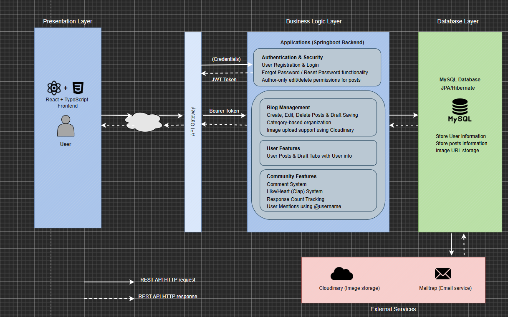

# 🚀 Space Themed Blog Application

A modern full-stack blogging platform focused on **Space Technology, Astronomy, Astrophysics, Cosmology, and Space Exploration**.

This project was developed to demonstrate backend engineering, authentication & authorization, REST API design, frontend integration, database management, and secure full-stack development practices.

The application evolved from a foundational blog system into a more specialized and production-oriented platform with a custom space-themed experience, community engagement features, and improved architecture.

---

# 🌌 Project Overview

Space Tech Blog is a community-driven platform where users can:

- Publish space-related articles
- Interact through comments and reactions
- Discover astronomy and astrophysics content
- Engage with a growing space enthusiast community
- Manage personal profiles and drafted content

The project emphasizes:

- Clean backend architecture
- Secure JWT authentication
- Role-based access control(Authorized & Unauthorized)
- Responsive modern UI
- RESTful API development
- Real-world full-stack workflows

---

# 🚀 Major Enhancements & Contributions

Compared to the foundational blog application, the following major enhancements and customizations were independently designed and implemented:

- Redesigned the platform into a Space Technology themed community blog
- Implemented JWT Authentication & Spring Security workflows
- Added Forgot Password / Reset Password functionality
- Developed comment and reaction (clap/heart) system
- Implemented user mentions using `@username`
- Added profile management with drafts and published posts
- Integrated Cloudinary for cloud-based image uploads
- Added role-based authorization for post editing/deletion
- Implemented clap limitations (maximum 50 claps per user per post)
- Improved backend architecture organization and API structure
- Added content warning banner during post creation
- Enhanced user interaction and engagement workflows

---

# ✨ Features

## 🔐 Authentication & Security

- JWT-based Authentication & Authorization
- User Registration & Login
- Password Encryption using Spring Security
- Forgot Password / Reset Password functionality
- Protected Routes & API Endpoints
- Author-only edit/delete permissions for posts

---

## 📝 Blog Management

- Create, Edit, Delete Posts
- Draft Saving Support
- Rich space-themed content publishing
- Category-based organization
- Image upload support using Cloudinary
- Warning banner for content guidelines during post creation

---

## 👤 User Features

- User Profile Page
- User Posts & Draft Tabs
- Authenticated user experience

---

## 💬 Community Features

- Comment System
- Like/Heart (Clap) System
- Limited to 50 claps per user per post
- Response Count Tracking
- User Mentions using `@username`
- Community-focused interactions

---

## 🎨 UI / UX Improvements

- Custom Space-Themed Interface
- Modern Responsive Design
- Improved Navigation Experience
- Better Content Readability
- Interactive Category Navigation

---

# 📸 Application Screenshots

<details>
<summary>Click to Expand Screenshots</summary>

<br>

## 🏠 Homepage



---

## ✍️ Post Page



---

## 👤 Sign Up Page



</details>
---

# 🛠 Tech Stack

| Layer | Technologies |
|---|---|
| Frontend | React, TypeScript, Vite, Tailwind |
| Backend | Java, Spring Boot |
| Security | Spring Security, JWT |
| Database | MySQL |
| ORM | Spring Data JPA / Hibernate |
| Media Storage | Cloudinary |
| Email Service | Mailtrap |
| API Style | REST API |
| Version Control | Git & GitHub |

---

# 🏗 System Architecture
<details>
<summary>Click to Expand Screenshot</summary>

<br>


</details>
---

# 🧩 Project Architecture

The backend follows a layered architecture to improve maintainability, scalability, and separation of concerns.

```text
src/main/java/com/project/blogApp
│
├── config          → Application & security configurations
├── controllers     → REST API endpoints
├── domain          → Entity models / DTOs
├── exception       → Exception handling
├── mappers         → DTO ↔ Entity mapping logic
├── repositories    → Database access layer (JPA repositories)
├── security        → JWT filters, authentication & authorization
├── services        → Business logic layer
└── BlogAppApplication.java
```

---

# 🔄 Application Flow

```text
Frontend (React + TypeScript)
        ↓
REST API Calls
        ↓
Spring Boot Controllers
        ↓
Service Layer (Business Logic)
        ↓
Repository Layer (JPA/Hibernate)
        ↓
MySQL Database
```

---

# 🔐 Authentication Flow

```text
User Login
   ↓
JWT Token Generated
   ↓
Frontend Stores Token
   ↓
Token Sent in Authorization Header
   ↓
Spring Security Validates JWT
   ↓
Access Granted to Protected APIs
```

---

# 🧪 Testing & Quality Assurance

The application was tested using multiple approaches to ensure functionality, security, responsiveness, and API reliability.

## ✅ Functional Testing

Tested major user workflows including:

- User Registration & Login
- JWT Authentication
- Password Reset Functionality
- Post Creation / Editing / Deletion
- Comment & Reaction Features
- Draft Saving
- User Mentions
- Authorization Restrictions

---

## ✅ API Testing

REST APIs were tested using:

- cURL
- Browser Network Inspection

---

# 📷 Media Handling

- Images are uploaded and managed using Cloudinary
- Optimized for blog content and user-generated media
- Secure external image hosting integration

---

# 📧 Email Functionality

Mailtrap is used for:

- Password reset email testing
- Email workflow development
- Secure testing during development phase

---

# 🚀 Getting Started

## 1️⃣ Clone the Repository

```bash
git clone <repository-url>
```

---

# 2️⃣ Backend Setup

## Navigate to Backend

```bash
cd backend
```

## Configure Environment Variables

Update your application properties:

```properties
spring.datasource.url=
spring.datasource.username=
spring.datasource.password=

jwt.secret=

cloudinary.cloud-name=
cloudinary.api-key=
cloudinary.api-secret=

mailtrap.username=
mailtrap.password=
```

## Run the Backend

```bash
./mvnw spring-boot:run
```

---

# 3️⃣ Frontend Setup

## Navigate to Frontend

```bash
cd frontend
```

## Install Dependencies

```bash
npm install
```

## Run Frontend

```bash
npm run dev
```

---

# 📚 Learning Outcomes

This project helped strengthen knowledge in:

- Spring Boot backend development
- REST API design
- JWT authentication workflows
- Spring Security
- React frontend integration
- Database design & JPA
- Full-stack application architecture
- Git & collaborative workflows
- Real-world debugging and deployment preparation

---

# 🔮 Future Improvements

- Real-time notifications
- Advanced search & filtering
- AI-assisted article recommendations
- OAuth login (Google)

---

# 📌 Acknowledgments

This project is an extended and enhanced version of the [Devtiro Blog Application](https://github.com/devtiro/devtiro-blog-app).

The original project served as a foundational reference, while major features, architecture improvements, UI redesigns, and community-focused functionality were independently developed and customized for this platform.

---

# 👩‍💻 Author

Developed as a Full-Stack Project focused on building scalable and secure modern web applications.
